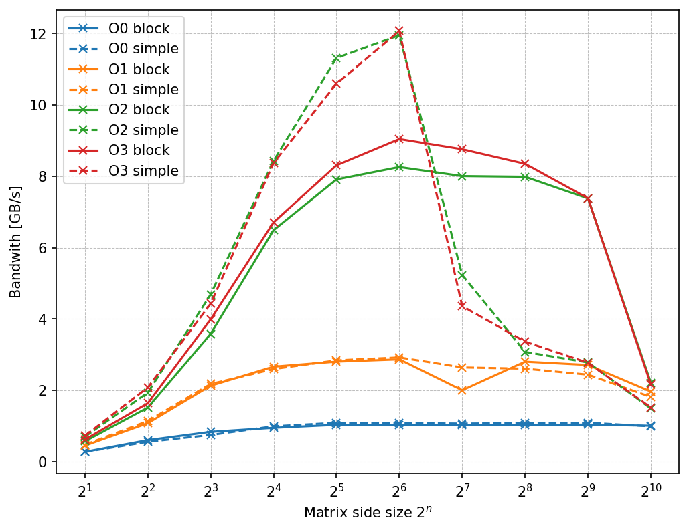
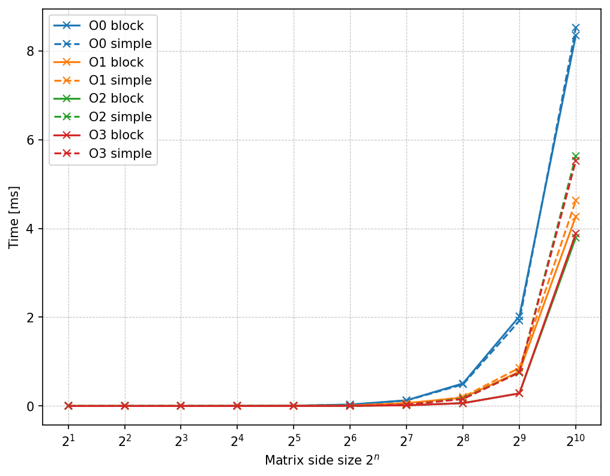

## Assignment instructions
Implement a simple algorithm that transposes a no-symmetric matrix
of size NxN.
- The algorithm takes the dimension of the matrix as input (use a power of 2).
- For example, `./transpose 10` transposes a 2^10 x 2^10 matrix
- Measure the Effective bandwidth of your implementation by using `-00 –O1 –O2 –O3` options.
Analyze the cache behavior.

## Runs
To reduce recording errors and OS noise, multiple executions were performed so that the total exec. time was $~1.5s$.

## Results
In this assignment we study how the system behaves with different matrix transpose implementations. Both a simple (sequential, with nested loops) and block implementation are visualized to better understand cache misses depending on how we access the data. 

**TL:DR** simple method workds better when $N \le 10^6$, while block method when $N > 10^6$; prefetching may improve performances when the matrix is big (D1 miss rate, most of the misses are due to write miss).

More info in `report.pdf`.

<center>
<table>
  <tr>
    <td align="center"><br> Effective Bandwidth   </td>
    <td align="center"><br>Execution time   </td>
  </tr>
  <tr>
    <td align="center"><br>L1 miss rate   </td>
    <td align="center"><br>D1 miss rate   </td>
  </tr>
  <tr>
    <td align="center"><br>LL miss rate   </td>
    <td align="center"><br>D references   </td>
  </tr>
</table>
</center>

## System info
<div style="display: flex; justify-content: center;">
  <div style="margin-right: 20px;">
    <table>
      <tr>
        <th colspan="2" align="center">Processor Specs</th>
      </tr>
      <tr>
        <td align="left">
          <b>Model:</b> AMD Ryzen 5 5600X <br>
          <b>Architecture:</b> x86 <br>
          <b>Clock Speeds:</b> 3.7 GHz base, 4.6 GHz boost <br>
          <b>Cache Levels:</b> L1 384 KB, L2 3 MB, L3 32 MB <br>
          <b>Cores, Threads:</b> 6, 12
        </td>
      </tr>
    </table>
  </div>
  <div style="margin-left: 20px;">
    <table>
      <tr>
        <th colspan="2" align="center">Memory Specs</th>
      </tr>
      <tr>
        <td align="left">
          <b>Type:</b> DDR4 <br>
          <b>Size:</b> 16 GB <br>
          <b>Speed:</b> 3200 MHz <br>
          <b>Memory Channels:</b> Dual Channel <br>
          <b>DOCP/AMP/XMP:</b> DOCP 3200 MHz
        </td>
      </tr>
    </table>
  </div>
</div>


## Dir structure
```
├── launcher.sh                 # [SLOW] Automatic experiment launcher, do not use in this repo as here there's no plot fn
├── log.txt                     # Param for `launcher.sh`
├── main.pdf                    # Project report
├── Makefile                    
├── plot                        # Images used in the report
│   ├── _bandwidth.png
│   ├── D1 miss rate.png
│   ├── double_bandwidth.png
│   ├── double_time.png
│   ├── D references.png
│   ├── float_bandwidth.png
│   ├── float_time.png
│   ├── L1 miss rate.png
│   ├── LL miss rate.png
│   └── _time.png
├── README.md
├── src                         # My library code
│   ├── matrix.cc
│   ├── matrix.h
│   ├── utils.cc
│   └── utils.h
└── transpose.cc                # Main file
```